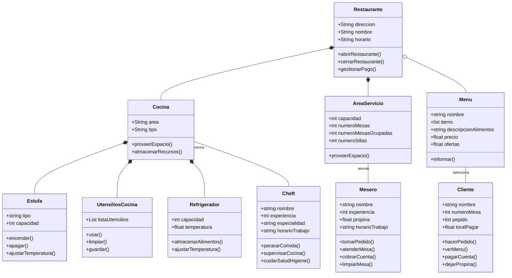

# Reto_02 
**Restaurante**: Es la clase principal que contiene atributos y métodos relacionados con la gestión del restaurante. Tiene relaciones con las clases `Cocina`, `Área de Servicio` y `Menú`.
````mermaid
classDiagram
    Restaurante *-- Cocina
    Restaurante *-- AreaServicio
    Restaurante o-- Menu
    Restaurante : +String direccion
    Restaurante : +String nombre
    Restaurante : +String horario
    Restaurante: +abrirRestaurante()
    Restaurante: +cerrarRestaurante()
    Restaurante: +gestionarPago()
````

**Cocina**: Contiene atributos y métodos relacionados con la gestión de la cocina. Tiene relaciones con las clases `Estufa`, `Utensilios de Cocina`, `Refrigerador` y `Chef`, las cuales cuentan con sus propios métodos y atributos.
- **Estufa**: Contiene atributos y métodos relacionados con la gestión de la estufa en la cocina.
- **Utensilios de Cocina**: Contiene atributos y métodos relacionados con los utensilios de cocina.
- **Refrigerador**: Contiene atributos y métodos relacionados con el refrigerador.

````mermaid
classDiagram
    Cocina *-- Estufa
    Cocina *-- UtensiliosCocina
    Cocina *-- Refrigerador
    Cocina "gestiona"-- Cheft

    class Cocina {
        +String area
        +String tipo
        +proveerEspacio()
        +almacenarRecursos()
    }

    class Estufa {
        +string tipo
        +Int capacidad
        +encender()
        +apagar()
        +ajustarTemperatura()
    }

    class UtensiliosCocina {
        +List listaUtensilios
        +usar()
        +limpiar()
        +guardar()
    }

    class Refrigerador {
        +int capacidad
        +float temperatura
        +almacenarAlimentos()
        +ajustarTemperatura()
    }

    class Cheft {
        +string nombre
        +int experiencia
        +string especialidad
        +string horarioTrabajo
        +prepararComida()
        +supervisarCocina()
        +cuidarSaludHigiene()
    }
````

**Área de Servicio**: Representa el área de servicio del restaurante y tiene una relación con la clase `Mesero`.
````mermaid
classDiagram
    AreaServicio "atiende"-- Mesero
    class AreaServicio{
      +int capacidad
      +int numeroMesas
      +int numeroMesasOcupadas
      +int numeroSillas
      +proveerEspacio()
    }
    class Mesero{
        +string nombre
        +int experiencia
        +float propina
        +string horarioTrabajo
        +tomarPedido()
        +atenderMesa()
        +cobrarCuenta()
        +limpiarMesa()
    }
````


**Menú**: Representa el menú del restaurante y tiene una relación con la clase `Cliente`.
````mermaid
classDiagram
    Menu "selecciona"-- Cliente
    class Menu{
      +string nombre
      +list items
      +string descripcionAlimentos
      +float precio
      +float ofertas
      +informar()
    }
    class Cliente{
        +string nombre
        +int numeroMesa
        +list pepido
        +float toralPagar
        +hacerPedido()
        +verMenu()
        +pagarCuenta()
        +dejarPropina()
    }
    
````
## Diagrama completo

